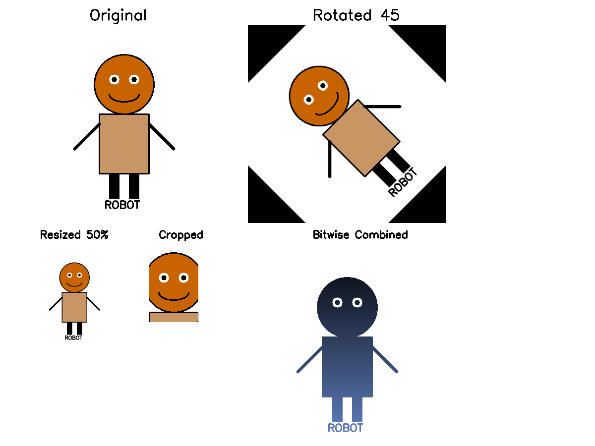

# UTS Computer Vision - Karakter Robot

## Informasi Mahasiswa
- **Nama:** [Raka Miftakhul Ulum]
- **NIM:** [43050230018]

## Penjelasan Karakter
Karakter yang dibuat adalah **Robot Sederhana** dengan komponen:
- **Kepala:** Lingkaran berwarna oranye
- **Mata:** Dua lingkaran putih dengan pupil hitam
- **Senyum:** Garis lengkung
- **Badan:** Persegi panjang berwarna biru
- **Tangan:** Dua garis hitam
- **Kaki:** Dua persegi panjang hitam
- **Teks:** Label "ROBOT" di bagian bawah

## Transformasi yang Digunakan
1. **Translation:** Menggeser karakter 50px ke kanan dan 30px ke bawah
2. **Rotasi:** Memutar karakter 45 derajat searah jarum jam
3. **Resize:** Mengubah ukuran karakter menjadi 50% dari ukuran semula
4. **Crop:** Memotong area wajah robot

## Operasi yang Digunakan
1. **cv2.add():** Menambahkan karakter dengan background gradient
2. **cv2.subtract():** Mengurangi karakter dengan background gradient
3. **cv2.bitwise_and():** Menggabungkan karakter dengan background menggunakan mask
4. **cv2.bitwise_or():** Operasi OR antara karakter dan background

## Hasil Akhir

## Struktur Proyek